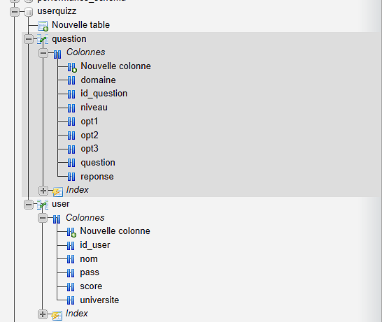

# Documentation de l’Application de Quiz

### Auteurs : Victor DAH et Ella DABIRE   

## Introduction
Cette application de quiz interactive a été conçue pour permettre aux utilisateurs de passer des examens, de consulter leurs scores, et pour les administrateurs de gérer les questions via une interface conviviale. Elle se compose de quatre parties principales :

- **Système de connexion**
- **Panneau d’administration**
- **Gestion de l’examen**
- **Système de score**

L’application utilise une base de données MySQL pour la gestion des utilisateurs, des questions, et des scores. Chaque partie est interconnectée pour assurer une fluidité dans l’expérience utilisateur.

---

## 1. Système de Connexion
Le système de connexion permet aux utilisateurs de se connecter ou de s’inscrire. Lors de la connexion, le système vérifie les informations d’identification dans la base de données et récupère les scores précédents. Si l’utilisateur est nouveau, il est invité à s’inscrire avec son nom, mot de passe et université. Un nouveau compte est alors créé avec un score initial de 0.

### Fonctionnalités :
- Connexion et inscription sécurisées
- Récupération des informations utilisateur depuis la base de données
- Vérification des identifiants

---

## 2. Panneau d’Administration
Le panneau d’administration permet aux administrateurs de gérer les questions du quiz. Il inclut des fonctionnalités pour ajouter, modifier, supprimer et rechercher des questions.

### Fonctionnalités :
- Ajout, modification et suppression des questions dans la base de données
- Recherche de questions par texte ou catégorie
- Interface conviviale avec gestion par champs de texte
- Bouton de déconnexion pour les administrateurs

---

## 3. Gestion de l’Examen
L’interface utilisateur pour l’examen permet aux participants de répondre à des questions dynamiquement importées de la base de données. Les questions sont classées par catégories et niveaux de difficulté. Un minuteur limite le temps de réponse à deux minutes par série de questions.

### Fonctionnalités :
- Affichage dynamique des questions
- Navigation entre les questions avec les boutons **Suivant** et **Précédent**
- Minuteur de deux minutes

---

## 4. Système de Score
À la fin du quiz, l’application compare les réponses de l’utilisateur avec les réponses correctes et calcule le score. Ce score est ensuite enregistré dans la base de données et est disponible pour consultation lors des futures connexions.

### Fonctionnalités :
- Calcul automatique du score basé sur les réponses correctes
- Enregistrement des scores dans la base de données
- Affichage des scores après chaque session d’examen

---

## 5. Méthodes d’Interface Graphique
Les méthodes suivantes sont utilisées pour construire l’interface graphique :

- `getMainJPanel()`
- `addHeading(JPanel panel1)`
- `addUtilisateur(JPanel panel1)`
- `addNom(JPanel panel1)`
- `addUniversite(JPanel panel1)`
- `addScore(JPanel panel1)`
- `addTotal(JPanel panel1)`
- `addAuthor(JPanel panel1)`
- `addLoginButton(JPanel panel1)`

---

## Schéma de la Base de Données



La base de données MySQL est structurée en deux tables principales :

### **Table Utilisateurs et Table Questions**  
Contient les informations d’identification des utilisateurs et leurs scores.
Stocke les questions, les catégories, les niveaux de difficulté, et les réponses correctes.
```sql
CREATE TABLE user (
    id INT AUTO_INCREMENT PRIMARY KEY,
    nom VARCHAR(50),
    pass VARCHAR(50),
    universite VARCHAR(100),
    score INT
);


sql
Copier le code
CREATE TABLE question (
    id INT AUTO_INCREMENT PRIMARY KEY,
    question VARCHAR(255),
    reponse VARCHAR(255),
    opt1 VARCHAR(255),
    opt2 VARCHAR(255),
    opt3 VARCHAR(255),
    domaine VARCHAR(100),
    niveau VARCHAR(50)
);
